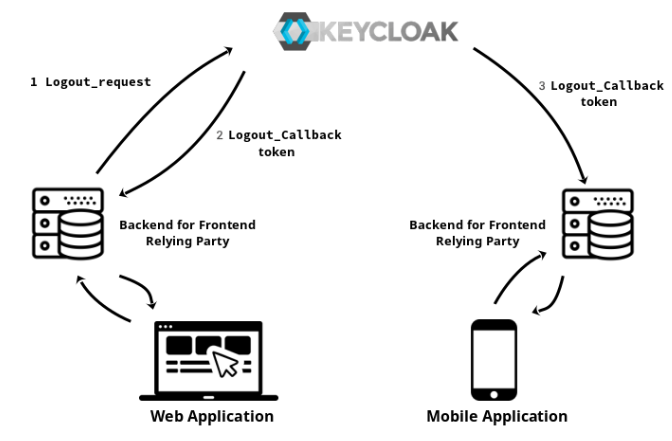
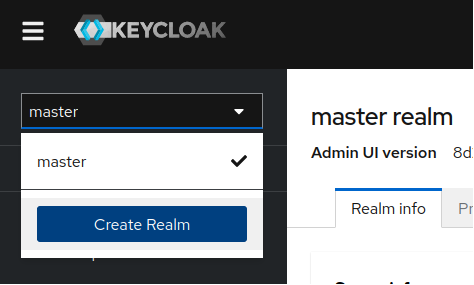
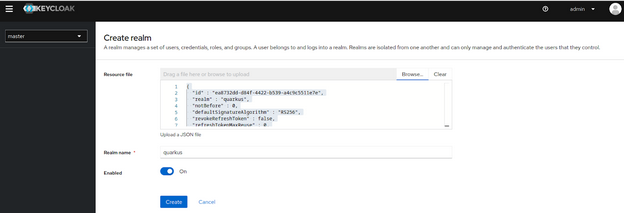
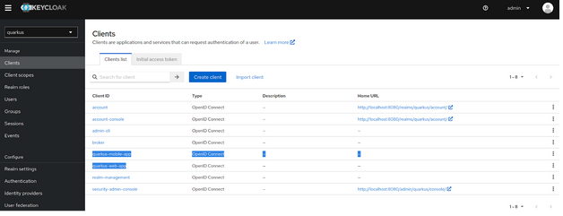
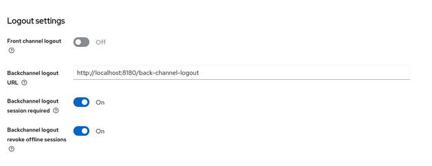
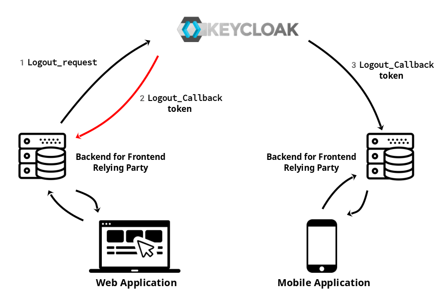
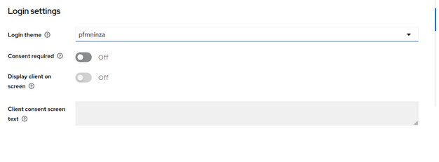
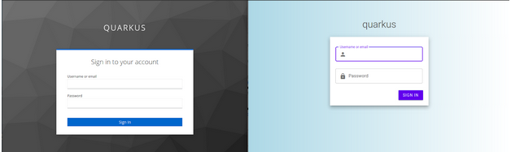
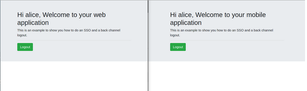
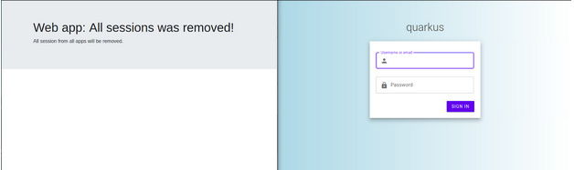

# Back channel logout demo

When we are talking about authentication most people focus on how to get an access token, 
but not so many articles are well described how to do a proper logout. This post explores implementing
a backchannel logout with Quarkus and Keycloak as OIDC providers.

## Demo Requirements

- Java 11+
- Keycloak ([download](https://github.com/keycloak/keycloak/releases/download/20.0.0/keycloak-20.0.0.zip))
- Maven 3.8.4
- Quarkus 2.13+
- Git cli 2.38+

## What is a back channel logout?

[OpenID Connect 1.0](https://openid.net/specs/openid-connect-backchannel-1_0.html) is the specification that defines the logout mechanism that uses direct back-channel communication 
between the OP (OpenID providers) in our case Keycloak and RPs (Relying Party) being logged out.



Basically and in plain words that this specification is saying that a back channel logout is a new flow that allows you to logout more than one application (Relying Party) thanks
to direct communication between the applications (RP) and Keycloak (OP). So, you could logout your mobile and this logout is going to invalidate the session on your tablet and for example,
a web application, and all of this is done bypassing the User Agent (without frontend consent).

The good point about backchannel logout flow is that is more reliable than communication through the User Agent, since in the front-channel,
the RP's browser session must be active for the communication to succeed. On the other hand, there are some contra parts, for example, the session will still be active on the browser,
so you will have to design some application flow between the parties (application frontend and backend) to remove the session, cookies, or any state on the frontend.
The solution could be something complex or just if you get a 401 from your backend, then remove all the browser local storage and redirect the client to the login screen.

Another significant limitation of back-channel logout is that the RP's back-channel logout URI (the application logout callback endpoint) must be reachable from all the OPs used (in our case Keycloak).
That means, for instance, that the applications cannot be behind a firewall or NAT when used with external or public OP. In our case, we will have the OP (Keycloak) and the RP (the services or application)
in the same network, so it is not going to be a problem

## Keycloak configuration

For this example we are going to use a baremetal [Keycloak](https://www.keycloak.org/) as an OpenID provider. You can [download](https://www.keycloak.org/downloads) your instance and 
load the [Realm configuration](/misc/back-channel-realm.json) provided on this git repository. If you have never used Keycloak before, you can think of Keycloak as an AuthN (authentication)
provider that follows OpenID Connect standard.

There are a lot of Keycloak concepts and configurations that you can [have a look](https://www.keycloak.org/docs/latest/server_admin/#core-concepts-and-terms), 
but for this post we only need to know what is a Realm and a client.

A realm is like an organization, I mean realms are completely isolated memory spaces (like Kubernetes namespaces) that hold data and configuration from one organization. 
So, If one day you are implementing a [multi-tenant Quarkus application](https://quarkus.io/guides/security-openid-connect-multitenancy), don’t forget to implement one realm per tenant.

Clients represent an application, so if you have one application for example a video player application that could be released by websites or mobile applications,
then it is probable that you end up with two clients in your realm, one for mobile applications and the other for web applications. The main motivation to have different clients per application/type
is that the authentication flow could be different for each case. For example, if you want to authenticate an end user in a single page application, you should use an oauth2 implicit flow that doesn’t return
a refresh token or another choice is a passwordless webAuthN flow. On the other hand, if your application has a BFF (backend for frontend), you could use an authorization code flow that is very secure and also
returns a refresh token. If you want to know more about authentications flows, please take a look [this site](https://auth0.com/docs/get-started/authentication-and-authorization-flow/which-oauth-2-0-flow-should-i-use).

Once we have clear what is a Realm and a Client, we are going to proceed to [download Keycloak](https://github.com/keycloak/keycloak/releases/download/20.0.1/keycloak-20.0.1.zip) and launch it in devmode.

```shell
./bin/kc.sh start-dev
```

Open a browser such as [Firefox](https://www.mozilla.org/en-US/firefox/new/)!.

And [login into keycloak](http://localhost:8080/) as an administrator: admin / admin

The first thing that we are gonna do is to create a new realm called “quarkus”, with all the required configuration that we need to do a back channel logout.
So, to add this realm configuration just click on the top right realm combo box and press the button “Create Realm



On the incoming screen, you will have to load the realm configuration, that in this case is on [this project](misc/back-channel-realm.json).
So please clone this GitHub project on your local host and push the realm into Keycloak.

```shell
git clone git@github.com:pjgg/Back-channel-logout-demo.git
```



Finally, press the button “Create”.

Once the realm is successfully created be sure that “quarkus” realm is selected on the top right realms combo box and then press over "Clients" on the right menu.
You will see that this realm has several clients but we are going to dive just in the following two:
- Quarkus-mobile-app
- Quarkus-web-app



Let’s get into one of them, so click over “Quarkus-web-app” and in the incoming windows scroll down until you see “Logout settings”:



* Backchannel logout URL is pointing to your web BFF logout callback URL. This is going to be your application endpoint that is going to be called once the logout takes place.



**Note:** On Quarkus this endpoint only needs to be defined on your application properties, but you don't need to implement the endpoint, because the callback request is not going to
be propagated until the end-user resource handler.

* Backchannel logout required will add the session ID (sid) Claim in the Logout Token when the Backchannel Logout URL is used.
* Backchannel logout revoke offline sessions, will add a "revoke_offline_access" in the Logout Token when the Backchannel Logout URL is used. Keycloak will revoke offline sessions
when receiving a Logout Token with this event.

On the other hand “Quarkus-mobile-app” client configuration is almost the same but is pointing to the mobile BFF callback URL.

To sum up, from KeyCloak point of view the only thing that is needed is to set up the “Backchannel logout URL”.

### Extra Keycloak configuration / custom login theme (Optional)

If you want to customize the login page, for the mobile application just move the [pfmninza-keycloak-theme-0.0.1.jar](misc/pfmninza-keycloak-theme-0.0.1.jar) to “keycloak-20.0.1/providers” 
folder and restart Keycloak.

Double check that Quarkus-mobile-app client configuration is pointing to this login theme



## Quarkus configuration

From Quarkus point of view, we are going to receive a logout token and we will validate it according to these [validations rules](https://openid.net/specs/openid-connect-backchannel-1_0.html#Validation),
if the token fits the specification, then a HTTP 200 will be returned to Keycloak. According to Quarkus [documentation](https://quarkus.io/guides/security-openid-connect-web-authentication#back-channel-logout)
we will need to define the backchannel logout URL in our application.properties.

```shell
# quarkus.oidc.logout.backchannel.path is implemented internally by Quarkus
quarkus.oidc.logout.backchannel.path=/back-channel-logout
```

Something that could sound weird to you, is that you don't need to implement this endpoint because is going to be implemented by Quarkus, so you will not be able to make any action when you receive the logout
token.

Another consideration that you should keep in mind is that the logout token must have an expiration date, so be sure to define a `quarkus.oidc.token.age` on your application.properties.

For example, 
```shell
quarkus.oidc.token.age=59M
```

So now that we have cleared the flow and the Quarkus configuration that is required, let's start both applications pointing to the previous [Keycloak instance](http://localhost:8080).

Start web application(port 8180):
```shell
mvn quarkus:dev -f ~/Downloads/back-channel-logout-demo/web-app-demo/
```

Start mobile application (port 8280):
```shell
mvn quarkus:dev -f ~/Downloads/back-channel-logout-demo/mobile-app-demo/
```

Open two incognito windows and load one application on each window.

- Web app Window: http://localhost:8180/code-flow
- Mobile app Window: http://localhost:8280/code-flow

**Note:** “/code-flow” is a protected resource so if you try to get into this path and you will not have a valid session, so you will be redirected to the application Keycloak login screen.



On the realm configuration that we load previously there is a default user / pwd “alice / alice”, so login into only one application and refresh the screen of the other application.



How OpenID connect implements the single sign-on, you only need to login into one client to have a valid session into the application (SSO is out of the scope of this post).
Finally, now we are ready to do a logout, so press the logout button in one of these applications and then the other application session will be also invalidated and redirected to the login screen.



Also, if you check the logs of your applications you will see that the backchannel logout URL was invoked

```shell
DEBUG [io.qua.oid.run.BackChannelLogoutHandler] (vert.x-eventloop-thread-2) Back channel logout request for the tenant Default received
```

At this point, we can say that the logout backchannel is done! so all sessions of all applications were removed and also
notified through the back channel logout URLs without the consent of the user agent (the browser in this example).

Well, I hope that you like this post and that also you learn new concepts as I did. Feel free to make any comments, questions, or open a debate.

Thanks,

## Terms glossary

* **OIDC:** is an acronym for openID connector, that basically is a simple identity layer on top of the OAuth 2.0[RFC6749] protocol. It enables Clients to verify the identity of the End-User based on the authentication performed by an Authorization Server, as well as to obtain basic profile information about the End-User in an interoperable and REST-like manner.
* **Clients:** is a RP (Relying Party) is an Actor within OAuth2 and is typically the application making requests to the RS (Resource Server) after being delegated by the RO (Resource Owner).
* **RP:** is an acronym for Relying Party is a system entity that decides to take an action based on information from another Entity. For example, an OAuth Client that supports OpenID Connect is also called a Relying Party because it relies on the OpenID Connect Provider to assert the user’s Digital Identity.
* **RS:** is an acronym for resource server is an Actor within OAuth 2.0 and OpenID Connect, service that is the Policy Enforcement Point and performs Access Control for the Protected Resource of the Resource Owner to the OAuth Client.
* **Protected Resource:** also known as Target Resource, is a Resource (for example an endpoint) to which a Subject is attempting to access.
* **RO:**  is an acronym for Resource Owner, and is an Actor within OAuth 2.0 and OpenID Connect, that is the owner the Protected Resource exposed by the Resource Server, typically an End-User or a Data subject
* **OP:** is an acronym for OpenID Providers, for example Keycloak
* **Access Token:** in OAuth 2.0  is a Token issued to the OAuth Client by the Authorization Server. Basically this token is the one that the services are going to exchange in order to access a Protected Resource.
* **BFF:** is an acronym for backend for front end. Separate backend services to be consumed by specific frontend applications or interfaces.

## Project Folder structure

[Github project ref](https://github.com/pjgg/Back-channel-logout-demo)

- misc/back-channel-realm.json: realm configuration that you should set up on your Keycloak instance
- misc/pfmninza-keycloak-theme-0.0.1.jar: custom Keycloak login theme that you should set up in `keycloak-20.0.0/providers` folder
- mobile-app-demo: represents a mobile application 
  - start: `mvn quarkus:dev -f mobile-app-demo`
  - endpoints:
    - http://localhost:8280/code-flow/
    - http://localhost:8280/code-flow/logout
- web-app-demo: represents a web application
  - start: `mvn quarkus:dev -f web-app-demo`
  - endpoints:
    - http://localhost:8180/code-flow/
    - http://localhost:8180/code-flow/logout
