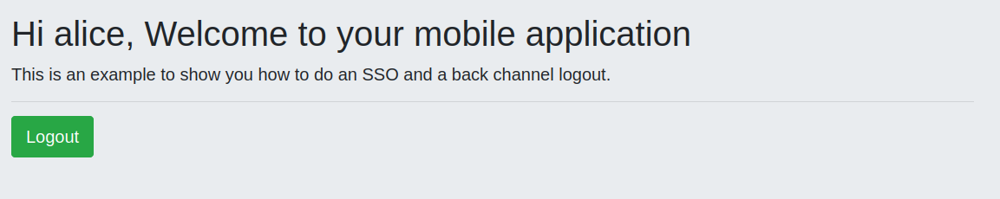

# Back channel logout demo

Back-Channel Logout is used by OpenID Connect providers to log out the current user from all the applications this user is currently logged in, bypassing the user agent.
On keycloak world does mean that you will do a single-sign-off a user inside a Realm. 

A realm represent an organization, and a ClientID an application. So you will have one clientID per application (for example, one clientID for a
mobile app and other clientID for a web app)

## Demo Requirements

- Java 11+
- Keycloak ([download](https://github.com/keycloak/keycloak/releases/download/20.0.0/keycloak-20.0.0.zip))
- Maven 3.8.4
- Quarkus 2.13+

## Folder structure
- misc/back-channel-realm.json: realm configuration that you should set up on your Keycloak instance
- misc/pfmninza-keycloak-theme-0.0.1.jar: custom Keycloak login theme that you should set up in `keycloak-20.0.0/providers` folder
- mobile-app-demo: represents a mobile application 
  - start: `mvn quarkus:dev -f mobile-app-demo`
  - endpoints:
    - http://localhost:8280/code-flow/
    - http://localhost:8280/code-flow/logout
- web-app-demo: represents a web application
  - start: `mvn quarkus:dev -f web-app-demo`
  - endpoints:
    - http://localhost:8180/code-flow/
    - http://localhost:8180/code-flow/logout

## Demo steps

Once you have Keycloak up and running launch both applications in two browsers and go to the login screen by accessing to a protected resource
as `http://localhost:8280/code-flow/` or `http://localhost:8180/code-flow/`

Mobile app login screen

Web app login screen

Login into one of this application (alice / alice) and once you are in, refresh the other screen. 

Mobile app code-flow protected resource

Web app code-flow protected resource

Finally, logout on one off these apps and refresh the other one (or try to access to a protected resource)

Logout mobile app -> `http://localhost:8280/code-flow/logout`

You will be redirected to the login screen in both apps (your session was removed from all your apps)

